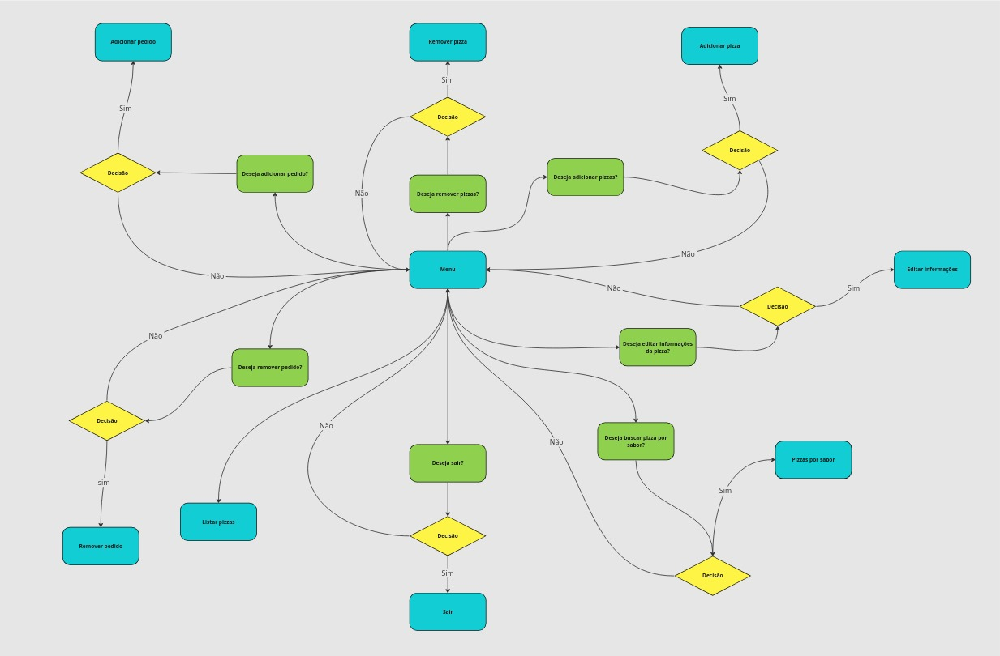
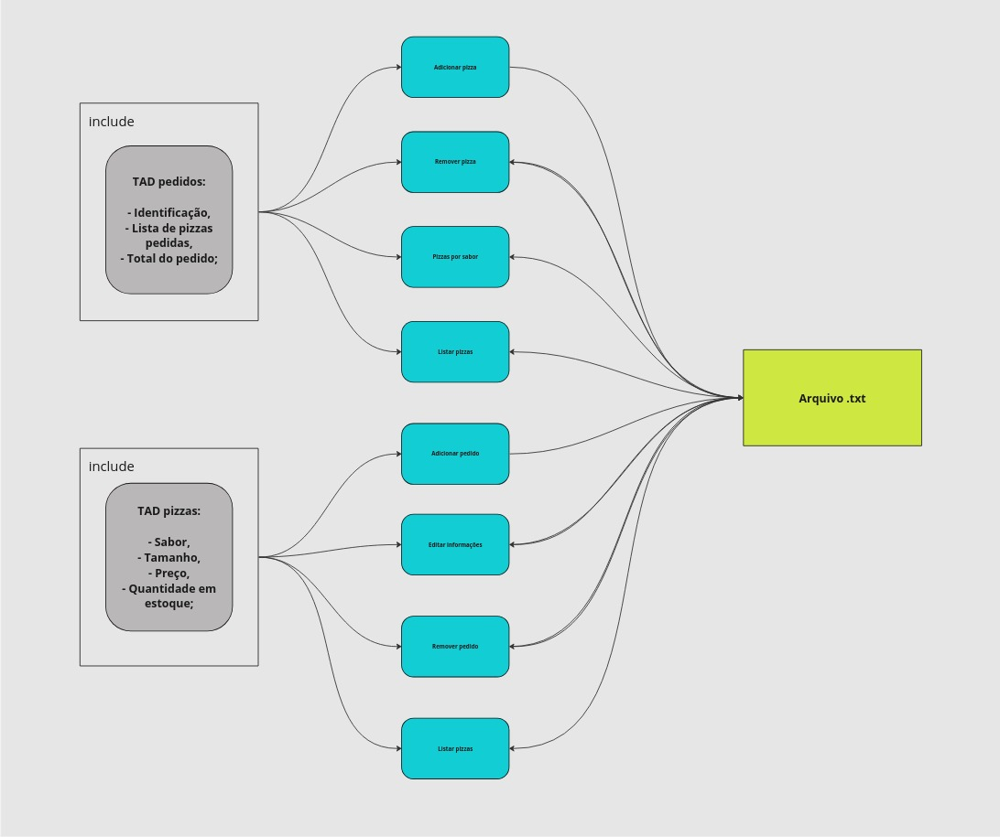
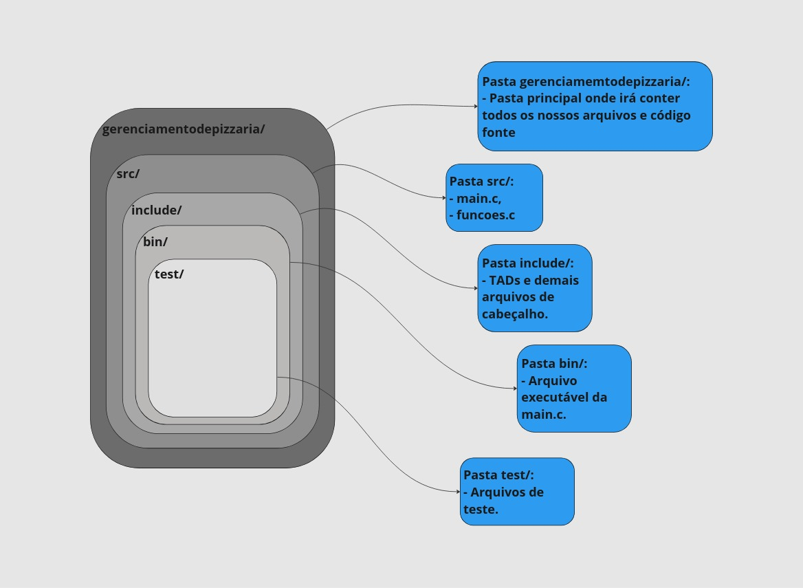

# <h1 align="center">Grupo 09: Gerencialmento de Pizzaria <h1>
Projeto desenvolvido como avaliação da terceira unidade da disciplina: Algoritmos e Estruturas de dados I, administrada. Trata-se de projetar um sistema na Linguagem C para gerenciamento de uma pizzaria, manipulando pedidos e pizzas.
## Requisitos
1. Pedidos deverá ter :
- Identificação;
- Lista de pizzas pedidas;
- Total pedido;

2. Pizzas precisa ter:
- Sabor;
- Tamanho;
- Preço;
- Quantidade de pizzas em estoque;

3. Necessitará de um menu contendo as seguintes opções:
- 1.Adicionar pizza;
- 2.Remover pizza;
- 3.Adicionar pedido;
- 4.Remover pedido;
- 5.Editar informação da pizza;
- 6.Buscar pizza por sabor;
- 7.Listar pizzas e quantidades disponíveis;
- 8.Sair.

4. Observação!
- A Opção Sair é a única que permite sair do programa. Sendo assim, após cada operação o programa volta ao menu.
- Cada execução do programa os dados devem ser carregados em um arquivo de texto e cada nova pizza ou pedido cadastrado deve ser inserido em ordem alfabética.
- Deve-se atualizar o arquivo texto pra refletir o estado atual dos dados em virtude da adição ou remoção.
- Deve ser atualizado a quantidade em estoque de pizzas a cada pedido.
## Sumário
* [Fluxograma - Funcionamento de Sistema](#fluxograma-funcionamento-do-sistema)
* [Fluxograma - Fluxo de Dados](#fluxograma-do-fluxo-de-dados)
* [Fluxograma - Organização do Sistema](#fluxograma-funcionamento-do-sistema)
* [Desenvolvedores](#desenvolvedores)
* [Fontes](#fontes)
## <h2 align="center">Fluxograma funcionamento do sistema </h2>

Na imagem abaixo apresentamos um fluxograma dos nossos estudos de como iria ocorrer o funcionamento bruto do sistema. Nele é possível verificar qual o comportamento das nossas funções a partir dos dados e escolhas feitas pelo usuário.

  

###### <h4 align="center">Legenda:</h3>

    

        - Os azuis são as nossas funções do sistema;
    

    

        - Os elementos amarelos são nossos estágios de escolha, ou seja, onde o usuário vai escolher o que o sistema vai realizar;
    

    

        - Os elementos verdes são nossas perguntas a serem exibidas para o usuário;
    

## <h2 align="center">Fluxograma do Fluxo de dados</h2>

O nosso fluxograma do fluxo de dados apresenta como os dados estarão se comunicando entre as nossas TADs, as funções e o nosso arquivo.txt

        

## <h2 align="center">Fluxograma da organização do sistema</h2>

O nosso fluxograma da organização dos dados explica dentro da estrutura do sistema como estarão organizados nossos arquivos de texto, códigos fontes e demais documentos que auxiliem o funcionamento do sistema

    

## Desenvolvedores
* [Allan Gabriel Silva Freitas](https://github.com/Allan-Gabriell)
* [Leonardo Augusto Silva de Sousa](https://github.com/LeonardAugusto)
## Fontes
